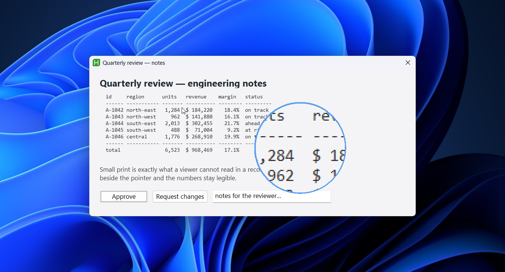
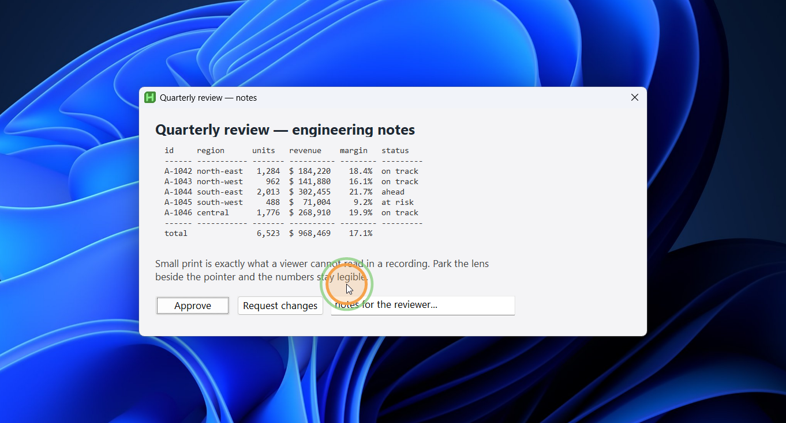
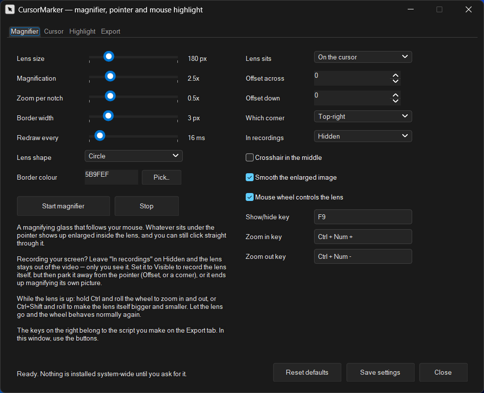
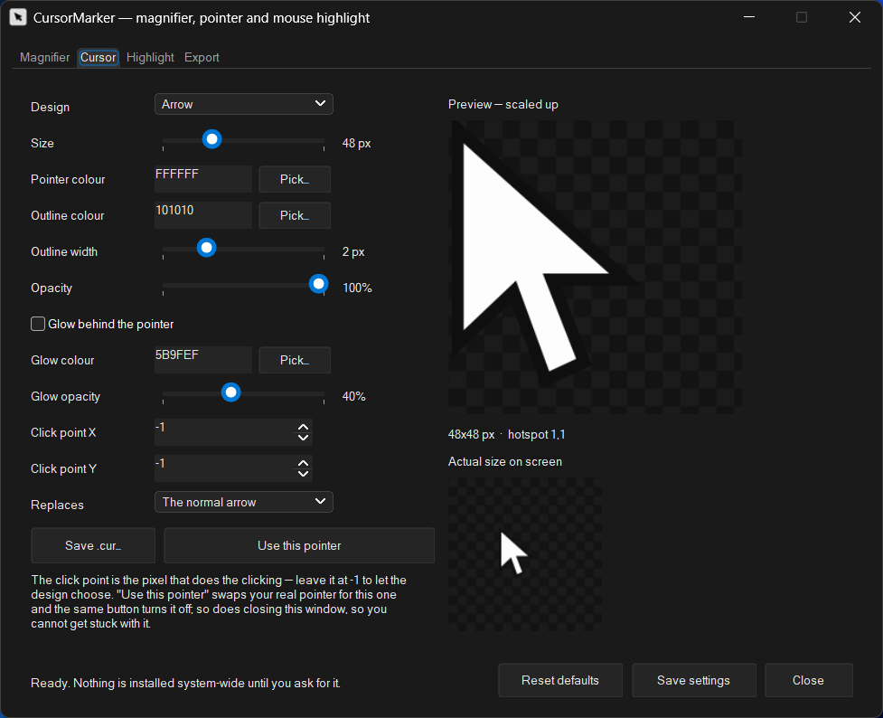
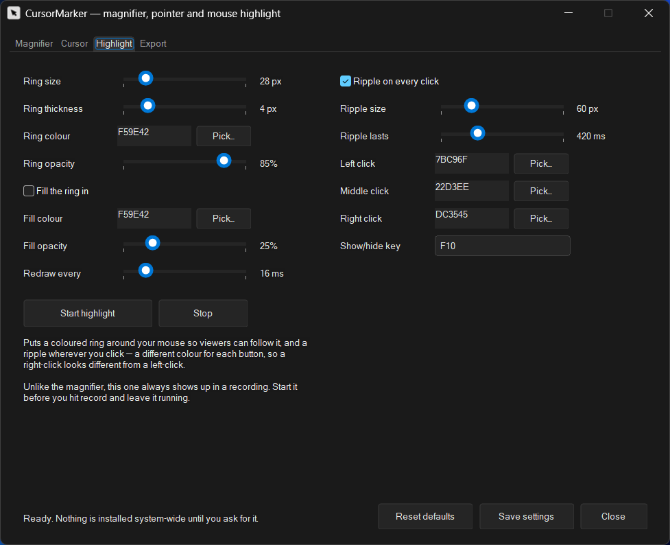
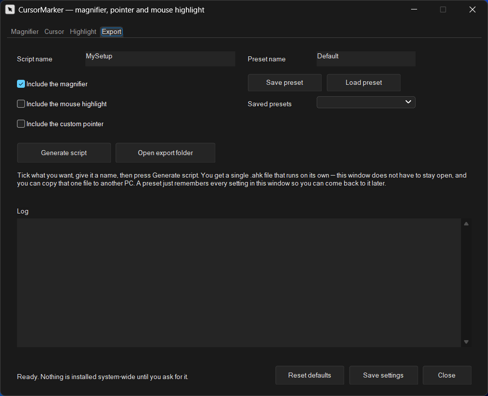

# CursorMarker

Makes your mouse easy to follow in a screen recording.



## Download

Get **CursorMarker.exe** from the
[latest release](https://github.com/TrueCrimeDev/CursorMarker/releases/latest) and
double-click it. Nothing to install — AutoHotkey is built in.

Windows will probably warn you the first time, because the file isn't signed:
**More info → Run anyway.** That's a reasonable thing to be wary of, so
[Check it yourself](#check-it-yourself) below explains exactly what you're running.

It keeps its settings in `%AppData%\CursorMarker` and leaves the rest of your PC alone.

## What it does

| Tab | |
| --- | --- |
| **Magnifier** | A magnifying glass that follows your mouse. Hold **Ctrl** and roll the wheel to zoom, **Ctrl+Shift** to make the lens bigger. You can click straight through it. |
| **Cursor** | Design your own mouse pointer — shape, colour, size, glow — and switch it on with one button. |
| **Highlight** | A coloured ring around the mouse, plus a ripple wherever you click, in a different colour for each button. |
| **Export** | Bundles what you set up into one file you can double-click later, without opening this window. |



<details>
<summary><b>What the window looks like</b></summary>

<br>









</details>

## Quick start

**Make your mouse easy to follow**

Open **Highlight**, press **Start highlight**, move the mouse around. Tweak the size and
colours, press **Stop** when you like it.

**Zoom in on something while recording**

Open **Magnifier**, press **Start magnifier**. Ctrl+wheel zooms. By default the lens is
hidden from recordings so only you see it — set **In recordings** to *Visible* if you
want it in the video, and move it off the pointer so it isn't magnifying itself.

**Get a big obvious pointer**

Open **Cursor**, pick a design and colour, press **Use this pointer**. The same button
turns it off, and so does closing the window — you can't get stuck with it.

**Keep your setup**

Open **Export**, tick what you want, press **Generate script**. You get one file that
does just those things when you run it, with this window closed.

## Check it yourself

Running an unsigned exe off the internet is a fair thing to hesitate over. Here's what
it is.

**Every line is plain text you can read right here in your browser.** There are no
compiled libraries, nothing downloaded while it runs, and no network access at all.

| File | What it's for |
| --- | --- |
| [`CursorMarker.ahk`](CursorMarker.ahk) | The window — every button, slider and label |
| [`Engine/LoupeEngine.ahk`](Engine/LoupeEngine.ahk) | The magnifier |
| [`Engine/HighlightEngine.ahk`](Engine/HighlightEngine.ahk) | The ring and the click ripples |
| [`Engine/CursorPainter.ahk`](Engine/CursorPainter.ahk) | Draws pointers and writes `.cur` files |
| [`Engine/ScriptExporter.ahk`](Engine/ScriptExporter.ahk) | Builds the file the Export tab makes |
| [`Engine/MarkerIcon.ahk`](Engine/MarkerIcon.ahk) | The app icon |
| [`Engine/MarkerCommon.ahk`](Engine/MarkerCommon.ahk) | Settings and colours |
| [`Icons/Cursor.png`](Icons/Cursor.png) | The icon artwork |

The only thing it ever launches is File Explorer, when you press *Open export folder*.
It writes nothing outside `%AppData%\CursorMarker` and the files you ask it to save.

**The exe is those exact files, nothing else.** It's built with AutoHotkey's own
compiler, which staples the script onto a copy of the AutoHotkey runtime:

```text
Ahk2Exe.exe /in CursorMarker.ahk /out CursorMarker.exe /base AutoHotkey64.exe /icon CursorMarker.ico
```

Every release lists a SHA-256, so you can confirm the file you downloaded is the file
that was published:

```powershell
Get-FileHash CursorMarker.exe -Algorithm SHA256
```

Still rather not run an exe? Don't — run it from source instead.

## Run from source

You need Windows 10 or 11 and [AutoHotkey](https://www.autohotkey.com/) **v2.1-alpha.30
or newer**. Download the repo, then run `CursorMarker.ahk`.

Dark mode is optional. Put [`DarkModeModular.ahk`](https://github.com/TrueCrimeDev/DarkMode)
in a `Lib` folder next to the CursorMarker folder and the window turns dark; without it
everything still works, just in Windows' default colours.

```text
SomeFolder\
  Lib\DarkModeModular.ahk        <- optional
  CursorMarker\CursorMarker.ahk
```

## Credits

- The magnifier grew out of **RockssJoke**'s screen magnifier on the AutoHotkey forums,
  packaged as a class by **The-CoDingman** as
  [The-Loupe](https://github.com/The-CoDingman/The-Loupe) (MIT).
- The ring-and-ripple idea came from **mesutakcan**'s
  [OBS-Cursor-Tools](https://github.com/mesutakcan/OBS-Cursor-Tools) (GPL-3.0). No code
  was taken from it — the implementation here is independent.
