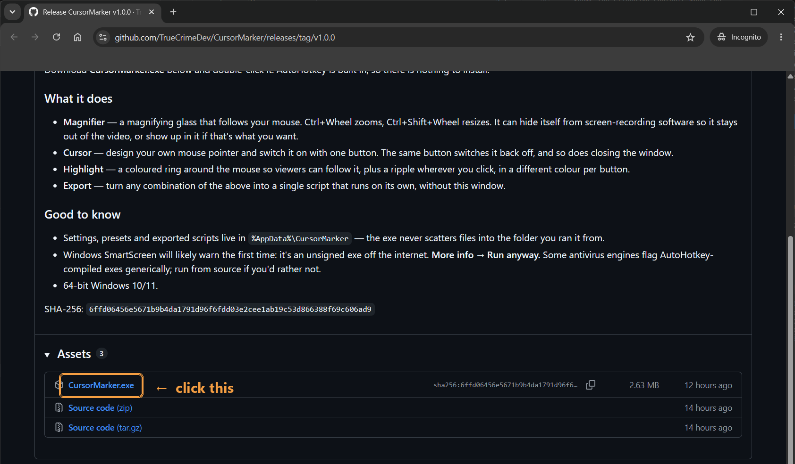
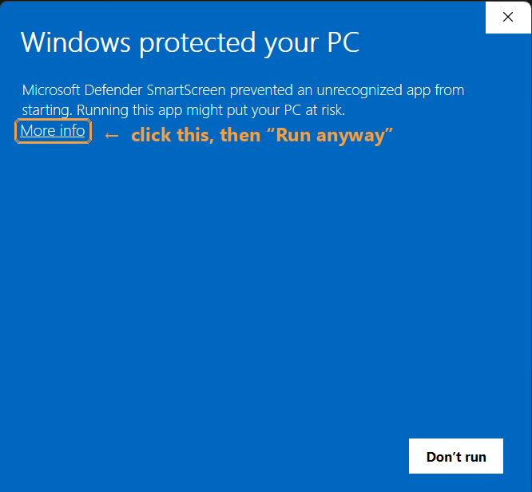
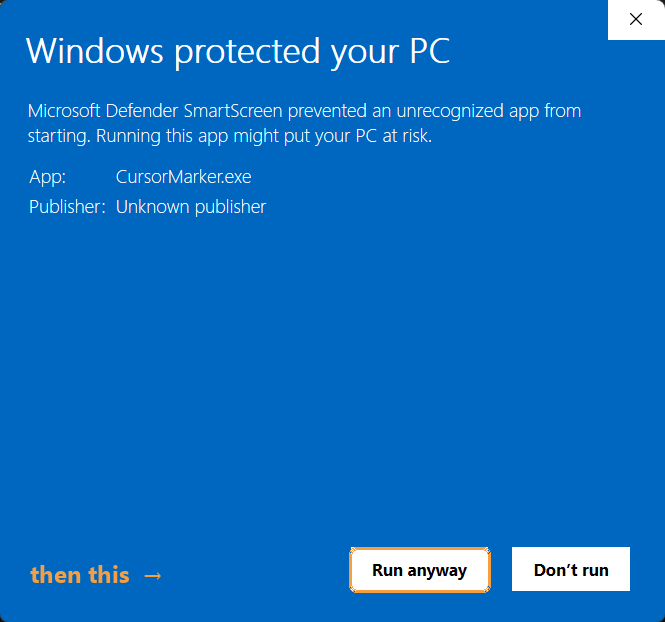

# CursorMarker

Makes your mouse easy to follow in a screen recording.


## Download

**1.** Open the [latest release](https://github.com/TrueCrimeDev/CursorMarker/releases/latest)
and click **CursorMarker.exe** under *Assets*:



**2.** Double-click the file you just downloaded. Windows will almost certainly stop you
the first time — click **More info**:



**3.** Now a **Run anyway** button appears. Click it:



That's it — nothing to install, AutoHotkey is built in.

Being stopped by a full-screen blue warning is a perfectly good reason to pause and ask
what's going on, so [here's why it happens](#why-windows-might-warn-you), and how to
check the file for yourself before you run it.

## What it does

| Tab | |
| --- | --- |
| **Magnifier** | A magnifying glass that follows your mouse. **Ctrl**+wheel zooms, **Ctrl+Shift**+wheel makes the lens bigger. You can click straight through it. |
| **Cursor** | Design your own mouse pointer — shape, colour, size, glow — and switch it on with one button. |
| **Highlight** | A coloured ring around the mouse, plus a ripple wherever you click, in a different colour for each button. |
| **Export** | Bundles what you set up into one file you can double-click later, without opening this window. |


<details>
<summary><b>What the window looks like</b></summary>

<br>


</details>

## Quick start

- **Highlight** → *Start highlight*, move the mouse, tweak the colours, *Stop*.
- **Magnifier** → *Start magnifier*, then Ctrl+wheel to zoom. The lens is hidden from
  recordings by default — only you see it.
- **Cursor** → pick a design, *Use this pointer*. The same button turns it off, and so
  does closing the window.
- **Export** → tick what you want, *Generate script*, and you get one file that does
  just those things.

## Why Windows might warn you

**"Windows protected your PC."** The file isn't signed. Signing needs a certificate that
costs money every year, so hobby projects usually skip it. Windows also scores files by
how many people have run them, and a brand-new file has a score of zero — so you'd get
this warning even if it were signed. Click **More info → Run anyway**.

**Your antivirus might flag it too.** Not for anything it does, but for what it *is*: a
compiled AutoHotkey program is the AutoHotkey runtime with a script stuck on the end.
Malware uses that same trick to smuggle a payload inside a normal-looking program, so
scanners flag the shape on sight, without knowing what the script says.

It doesn't help that this program really does do the three things scanners watch for:

| What it does | Why it needs to | What a scanner sees |
| --- | --- | --- |
| Notices your mouse clicks | To draw the ripple where you clicked | A keylogger |
| Reads the screen | To magnify whatever is under the pointer | Screen spying |
| Replaces the mouse pointer | That's the Cursor tab | Tampering with Windows |

Those three things *are* the program. There's no way to build it without them.

**What it never does:** no internet access of any kind, no changes to the Windows
registry, and nothing written outside `%AppData%\CursorMarker` and the files you ask it
to save. The only other program it ever starts is File Explorer, when you press
*Open export folder*.

**Don't take my word for it.** Every line is plain text you can read right here:

| File | What it's for |
| --- | --- |
| [`CursorMarker.ahk`](CursorMarker.ahk) | The window — every button, slider and label |
| [`Engine/LoupeEngine.ahk`](Engine/LoupeEngine.ahk) | The magnifier |
| [`Engine/HighlightEngine.ahk`](Engine/HighlightEngine.ahk) | The ring and the click ripples |
| [`Engine/CursorPainter.ahk`](Engine/CursorPainter.ahk) | Draws pointers and writes `.cur` files |
| [`Engine/ScriptExporter.ahk`](Engine/ScriptExporter.ahk) | Builds the file the Export tab makes |
| [`Engine/MarkerIcon.ahk`](Engine/MarkerIcon.ahk) | The app icon |
| [`Engine/MarkerCommon.ahk`](Engine/MarkerCommon.ahk) | Settings and colours |

The exe is those exact files and nothing else, built with AutoHotkey's own compiler.
Each release lists a SHA-256 so you can confirm your download is the file that was
published:

```powershell
Get-FileHash CursorMarker.exe -Algorithm SHA256
```

Still rather not run an exe? Don't — run it from source instead.

## Run from source

You need Windows 10 or 11 and [AutoHotkey](https://www.autohotkey.com/) **v2.1-alpha.30
or newer**. Download the repo and run `CursorMarker.ahk`.

Dark mode is optional: put [`DarkModeModular.ahk`](https://github.com/TrueCrimeDev/DarkMode)
in a `Lib` folder next to the CursorMarker folder. Without it everything still works,
just in Windows' default colours.

## Credits

The magnifier grew out of **RockssJoke**'s screen magnifier on the AutoHotkey forums,
packaged as a class by **The-CoDingman** as
[The-Loupe](https://github.com/The-CoDingman/The-Loupe) (MIT). The ring-and-ripple idea
came from **mesutakcan**'s
[OBS-Cursor-Tools](https://github.com/mesutakcan/OBS-Cursor-Tools) (GPL-3.0) — no code
was taken from it.
